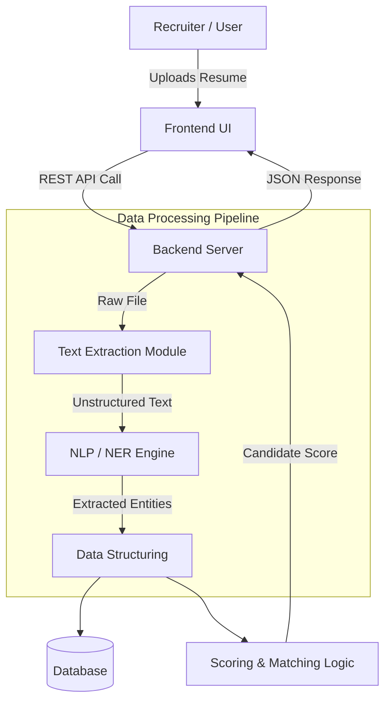
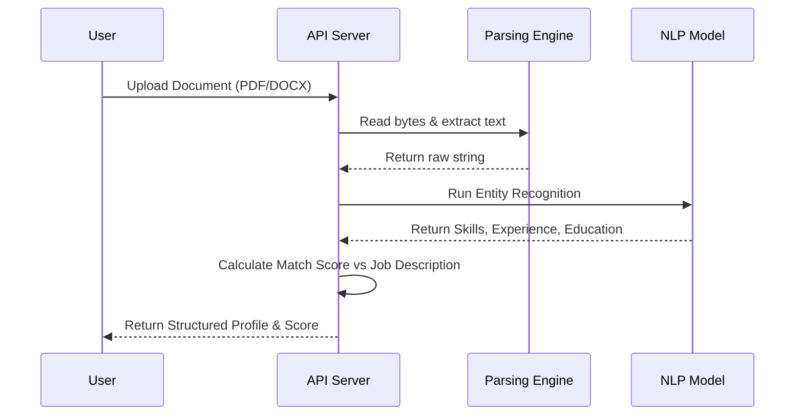

<div align="center">

# 🚀 Resume-Screnning
### AI-Powered Resume Screening & Candidate Analysis Platform


<p align="center">
  
  
  
  
  
  
</p>

---

### ⚡ Transforming Resumes into Intelligent Hiring Insights

</div>

---

# 📌 Overview

**Resume-Screnning** is an AI-powered resume screening platform designed to automate candidate analysis, resume parsing, and intelligent hiring workflows.

The system processes unstructured resumes and transforms them into structured candidate data using modern backend architecture, NLP-ready pipelines, and scalable API design.

Built using:
- ⚙️ FastAPI backend
- 🖥️ React + Vite frontend
- 🧠 NLP-ready parsing workflows
- 📄 Resume extraction pipelines
- 🚀 Scalable ATS-oriented architecture

---

# ✨ Features

## ✅ Current Features

- 📄 Resume upload system
- 🔍 Automated text extraction
- 🧠 Resume parsing workflows
- ⚡ FastAPI REST API
- 🖥️ Modern React frontend
- 📂 PDF/DOCX processing support
- 🔄 Frontend-backend integration
- 🚀 Scalable project architecture

---

# 🏗️ Project Structure

```bash
resume-screnning/
│
├── backend/
│   ├── main.py                # FastAPI backend server
│   ├── uploads/               # Uploaded resumes
│   ├── parser/                # Resume parsing logic
│   ├── models/                # NLP / AI models
│   └── utils/                 # Helper functions
│
├── frontend/
│   ├── src/                   # React/Vite frontend
│   ├── public/
│   └── components/            # UI components
│
├── package.json
├── .gitignore
├── LICENSE
└── README.md
```

---

# ⚡ Tech Architecture

## 🖥️ Frontend
- React / Vite frontend
- Resume upload interface
- Candidate score visualization
- API communication layer

## ⚙️ Backend
- FastAPI-powered REST API
- Resume upload handling
- Parsing & extraction pipeline
- AI/NLP integration layer

## 🧠 AI Processing Layer
- Resume text extraction
- Entity recognition
- Skill detection
- Candidate-job matching

---

# 🏛️ System Architecture



---

# ⚙️ Processing Workflow



---

# 🔄 Request Lifecycle

```text
User Uploads Resume
        ↓
Frontend Sends File
        ↓
FastAPI Backend Receives Request
        ↓
Resume Parsing Engine Extracts Text
        ↓
NLP Engine Detects Skills & Entities
        ↓
Scoring Engine Calculates Match %
        ↓
JSON Response Returned
        ↓
Frontend Displays Results
```

---

# ⚙️ Tech Stack

| Layer | Technology |
|---|---|
| Frontend | React + Vite |
| Backend | FastAPI |
| Language | Python |
| AI/NLP | spaCy / Transformers (planned) |
| File Parsing | PDF/DOCX Processing |
| Deployment | Docker / Cloud (planned) |

---

# 🚀 Installation

## Clone Repository

```bash
git clone https://github.com/your-username/resume-screnning.git
cd resume-screnning
```

---

## Backend Setup

### Create Virtual Environment

```bash
python -m venv venv
```

### Activate Environment

#### Windows
```bash
venv\Scripts\activate
```

#### Linux / Mac
```bash
source venv/bin/activate
```

### Install Backend Dependencies

```bash
pip install -r requirements.txt
```

### Start Backend Server

```bash
uvicorn main:app --reload
```

---

## Frontend Setup

```bash
cd frontend
npm install
npm run dev
```

---

# ▶️ API Endpoints

| Endpoint | Method | Description |
|---|---|---|
| `/analyze-resume` | POST | Upload & analyze resume |
| `/chat-with-bot` | POST | AI resume assistant |
| `/health` | GET | API health check |

---

# 🚀 Live Deployment & Links

## 🌐 Deployment

- **Live Application:** [Launch Resume Screener](https://your-deployment-link.com)
- **API Documentation:** [View Swagger / Redoc](https://your-deployment-link.com/docs)
- **Docker Hub Image:** [`docker pull your-username/resume-screening`](https://hub.docker.com/r/your-username/resume-screening)

---

## 🔄 CI/CD Pipeline Status

[](https://github.com/ks9019928-hub/resume-screnning/actions)

---

# 📊 Current Workflow

```text
Resume Upload
      ↓
Text Extraction
      ↓
Data Cleaning
      ↓
NLP Processing
      ↓
Skill & Entity Detection
      ↓
Candidate Scoring
      ↓
Frontend Visualization
```

---

# 🔮 Future Development

The long-term vision of **Resume-Screnning** is to evolve into a fully intelligent recruitment automation ecosystem powered by AI, NLP, and scalable cloud infrastructure.

---

## 🧠 AI & Machine Learning Enhancements

### 📌 Semantic Resume Understanding

Future versions will integrate:
- spaCy
- NLTK
- Transformer-based models
- Large Language Models (LLMs)

Capabilities:
- Context-aware skill extraction
- Experience summarization
- Career progression analysis
- Semantic understanding beyond keywords

---

## 🤖 Intelligent Candidate Matching

Planned systems:
- Resume-to-job semantic similarity scoring
- ATS compatibility analysis
- AI-powered candidate ranking
- Smart recommendation systems
- Recruiter-focused filtering algorithms

---

## 🌐 API & Enterprise Scalability

Future infrastructure:
- REST API expansion
- Microservice deployment
- Docker containerization
- Kubernetes orchestration
- Cloud-native scalability

Target platforms:
- AWS
- Azure
- Google Cloud

---

## 📊 Recruitment Analytics Dashboard

Future dashboards will visualize:
- Skill distribution across applicants
- Candidate ranking metrics
- Hiring trends
- Keyword frequency analysis
- Talent intelligence insights

---

## 🔐 Enterprise Security & Authentication

Planned features:
- JWT authentication
- OAuth integration
- Role-based access control
- Resume encryption
- Secure file handling
- Audit logging

---

## 📄 Multi-Format Document Support

Upcoming support:
- Advanced PDF parsing
- DOCX optimization
- OCR for scanned resumes
- LinkedIn profile ingestion
- Image-to-text extraction

---

## ☁️ DevOps & Cloud Expansion

Future roadmap:
- CI/CD pipelines
- Automated testing
- Docker deployment
- Monitoring & logging
- Horizontal scaling
- Infrastructure as Code (IaC)

---

# 🚀 Planned Milestones

| Version | Planned Features |
|---|---|
| v1.0 | Basic Resume Parsing |
| v2.0 | NLP & Entity Recognition |
| v3.0 | AI Candidate Scoring |
| v4.0 | Dashboard & Analytics |
| v5.0 | Cloud Deployment & APIs |
| v6.0 | Enterprise ATS Platform |

---

# 🌟 Why This Project Matters

Modern recruitment systems process thousands of resumes daily.

This platform explores how intelligent parsing systems can:
- Reduce HR workload
- Improve hiring efficiency
- Standardize candidate evaluation
- Enable scalable recruitment automation

It demonstrates practical backend engineering combined with future-ready AI architecture.

---

# 🧪 Potential Use Cases

- Automated HR screening
- Recruitment workflow automation
- Candidate filtering systems
- Talent analytics
- Resume intelligence pipelines
- Enterprise ATS integration

---

# 🤝 Contributing

Contributions are welcome.

## Steps

1. Fork the repository

2. Create your feature branch

```bash
git checkout -b feature/AmazingFeature
```

3. Commit your changes

```bash
git commit -m "Add AmazingFeature"
```

4. Push to the branch

```bash
git push origin feature/AmazingFeature
```

5. Open a Pull Request

---

# 🛡️ License

This project is licensed under the MIT License.

---

# 👨‍💻 Author

### Developed with passion for:
- AI Systems
- Backend Engineering
- Recruitment Automation
- Scalable Software Architecture

---

<div align="center">

# ⭐ Support The Project

If you found this repository useful:

🌟 Star the repository  
🍴 Fork the project  
🚀 Contribute to development  

---

### “Turning resumes into intelligent hiring insights.”

</div>